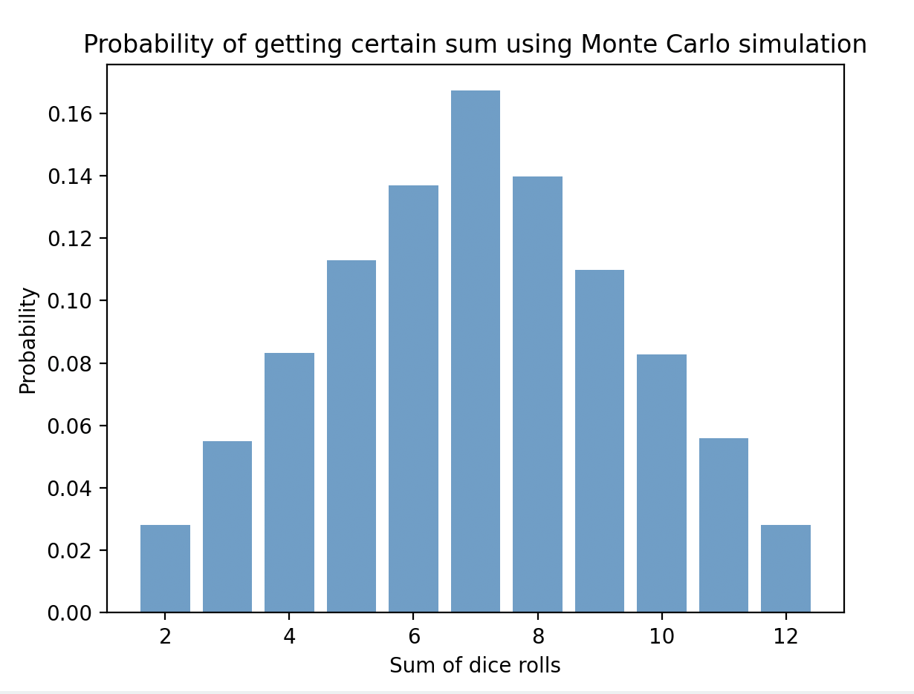

## Висновки по завданню 7.

### Результати рахрахунків.

| Сума | Імовірність |
|  2   |    0.0283   |
|  3   |    0.0546   |
|  4   |    0.0833   |
|  5   |    0.1114   |
|  6   |    0.1401   |
|  7   |    0.1681   |
|  8   |    0.1378   |
|  9   |    0.1109   |
| 10   |    0.0846   |
| 11   |    0.0539   |
| 12   |    0.0271   |

### Графік результатів разрахунків.

Як видно з розрахунків получені результати дуже близькі до теоретичних показників.

| Сума | Імовірність   |
|------|---------------|
| 2    | 2.78% (1/36)  |
| 3    | 5.56% (2/36)  |
| 4    | 8.33% (3/36)  |
| 5    | 11.11% (4/36) |
| 6    | 13.89% (5/36) |
| 7    | 16.67% (6/36) |
| 8    | 13.89% (5/36) |
| 9    | 11.11% (4/36) |
| 10   | 8.33% (3/36)  |
| 11   | 5.56% (2/36)  |
| 12   | 2.78% (1/36)  |